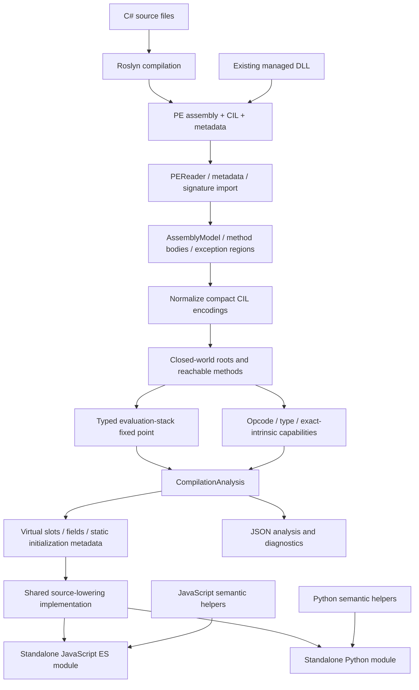
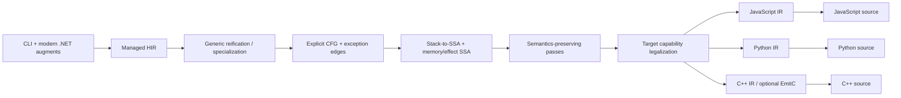

# Architecture: a managed-semantics compiler with multiple source backends

Status: initial implementation, 2026-09-16. **Implemented components and proposed components are distinguished throughout.** See [research](research/industry-state-2026-09-16.md) for external evidence and [specification](specification.md) for the current executable contract.

## 1. Architectural decision

Roslyn is the C# frontend. A real CLI assembly is the canonical input to the portable compilation path. JavaScript and Python are source backends, not alternate CLR hosts. The generated application contains target-language semantic helpers but does not load its original DLL, invoke a .NET subprocess, use Python.NET, or ship a generic IL bytecode interpreter.

This is an assembly-to-source compiler. Calling it a syntax transpiler would obscure the most important part of its contract: the same imported method bodies drive both targets.

## 2. Physical module boundaries, implemented now

| Project | Responsibility | Dependencies |
|---|---|---|
| `Transpiler.Core` | Immutable import models, low-level CIL decoder, PE/metadata importer, normalization, reachability, stack-state analysis, diagnostics, intrinsic signatures | .NET framework APIs only |
| `Transpiler.Frontend.Roslyn` | Compile C# 14 sources to PE and portable PDB; expose compiler diagnostics | Core and SDK-shipped Roslyn assemblies |
| `Transpiler.Backends` | Linkage metadata, virtual-slot tables, shared source emitter, bundled JS/Python semantic implementations | Core |
| `Transpiler.Cli` | Input/output, command parsing, diagnostics, inspect/analyze/compile/capability commands | The preceding projects |
| `tests` | CoreCLR differential oracle, target execution, deterministic re-emission, rejection corpus, library ABI checks | Python standard library; external `dotnet` and `node` executables |

The initial backend selection is an enum with one shared emitter, not a dynamically discovered plugin system. A public backend registry and independently packaged backend projects are planned after the managed IR contract stabilizes. Do not infer plugin loading from the long-term architectural diagrams.

## 3. Data flow and invariants

### Frontend boundary

`RoslynFrontend.Compile` accepts explicitly named source files and optional assembly references. It emits real PE bytes and a portable PDB. It does not translate C# syntax directly into either target. Release and Debug CIL are both tested. Source names are normalized to file names by the CLI; duplicate file names within a compilation are rejected to avoid ambiguous provenance.

The current reference set comes from the compiler host's trusted platform assemblies. This makes the PoC self-contained with its chosen SDK, but is not a hermetic reference-pack resolver. The future resolver must locate the chosen target-framework reference pack, hash every input, resolve package assets deterministically, and record the exact SDK/compiler/reference-pack identity in a build manifest.

### Import boundary

`AssemblyImporter.Read` uses `PEReader` and `MetadataReader`; it does not execute module initializers or use `Assembly.Load` on input. The decoder preserves original IL offsets, next offsets, method signatures, locals, and exception-region boundaries. Metadata tokens are resolved into method/field/type descriptions rather than guessed from source spelling.

The current linker scope is **one input assembly**. Framework calls are satisfied only by exact registered intrinsics. `--reference` helps Roslyn bind source, but does not promise that the referenced assembly's implementation is linked into the target output. Unsupported external implementation dependencies are diagnosed.

### Reachability and capability boundary

Executable roots are the managed entry point. Library roots are public static methods. Reachability adds direct internal calls, candidate virtual overrides, and relevant type initializers. The engine checks reachable method signatures, locals, field access, opcodes, and external intrinsic signatures before emitting a target artifact.

A few unsupported metadata shapes are conservatively rejected during import even when unused: MethodImpl override maps and vararg methods. This is intentionally stronger than perfect tree shaking. Capability reporting must describe this rather than suggesting every unreachable unsupported feature is harmless.

### Stack analysis boundary

Each instruction boundary has an incoming evaluation-stack vector. Kinds distinguish `i4`, `i8`, floating evaluation values, object references, and typed managed references. A worklist propagates these vectors over branches and handler entries. Joins must have identical stack shape/kinds. Arguments, locals, call signatures, return shape, and `maxstack` constrain propagation.

This is **not full ECMA verification**. Object references currently collapse to one stack category; subtype proofs, constructor initialization state, all byref lifetime/escape rules, all protected-region branch restrictions, and complete metadata identity are not proven. The compiler is not a security boundary for adversarial assemblies.

### Output boundary

The emitter visits statically known instructions and prints concrete source statements. For example, integer addition becomes a call with a compile-time operation and stack-kind constant, not an instruction fetched from an input bytecode stream. A generated method uses a program-counter dispatcher to represent arbitrary control flow, including irreducible flow. Output metadata contains type/linkage/exception information, **not an executable instruction array**.

This conservative control-flow lowering is intentionally retained as a correctness baseline. It is neither an SSA optimizer nor an idiomatic source-code decompiler, and performance claims should not be inferred from it.

## 4. Runtime object model

| Representation | Meaning |
|---|---|
| `CliObject(type, fields)` | Managed class identity and instance storage |
| `CliString(text)` | String reference identity, with UTF-16 operations and literal interning |
| `CliArray(element, data)` | Element type and checked zero-based vector storage |
| `CliBox(type, value)` | Primitive boxed value with exact boxed type identity |
| `CliRef(get, set)` | Managed address to argument/local/field/array/box storage |
| `CliError(value)` | Host exception wrapper carrying the managed exception object |
| `CliFlow` | Per-frame protected-region search and pending finally/fault continuations |
| `CliRuntime` | Method linkage, intrinsic dispatch, static state, allocation, conversions and semantic helpers |

Host garbage collection reclaims these wrappers. This does not implement .NET finalization timing, weak-reference behavior, pinning, heap inspection, or explicit GC APIs. Resource lifetime must remain explicit in future compatibility layers.

### Numeric representation

JavaScript `Int64`/`UInt64` use BigInt. The reference implementation also uses exact BigInt intermediate arithmetic for integer helpers where Number multiplication would lose information. Python uses integers with explicit masks/sign interpretation. Stack storage, signed operation, unsigned operation, and storage coercion are separate concepts.

Unchecked arithmetic wraps at the selected width; checked arithmetic checks mathematical bounds before wrapping. Signed division truncates toward zero. Shift counts are masked to the operand width. The current numerical profile selects CoreCLR x64's overflow behavior for signed minimum divided **or remaindered** by minus one; this platform-specific edge is explicitly documented in the specification.

Binary64 operations account for division by signed zero and unordered NaN comparisons. Binary32 storage/rounding, decimal, native integers, all formatting/culture cases, and bit-exact NaN payload transport remain separate work items.

### Managed references and copies

A reference is a storage location, not a copied value. Aliasing the same location twice must remain observable. `CliRef` therefore points to a getter/setter pair with typed coercion. The current supported value types are primitives. General structs require a future storage/value/address distinction: loading a struct value copies it; obtaining its address aliases it; boxing copies it into a box. A dictionary of fields alone cannot make all three behaviors correct.

### Dispatch

Virtual slots are distinct from names. A normal override reuses its base slot; `newslot` creates another slot even when its source name matches. Generated type tables flatten inherited slots. Nonvirtual `call` and virtual/null-checking `callvirt` stay distinct. Arbitrary MethodImpl maps, interface dispatch, generic virtual methods, and covariant-return adaptation are not implemented.

### Static initialization

Per-type state distinguishes not started, running, completed, and failed. Recursion into a running initializer observes current storage. A failed initializer is wrapped as a type-initialization failure and remains failed. For `beforefieldinit` types, initialization may be deferred until field access. No multithreaded initialization locking is provided by this single-threaded profile.

### Exception continuations

The pending continuation records the remaining handlers, final target, managed exception, selected catch, and active finally/fault handler. A local exception caught inside a finally must not discard the earlier pending exception. An exception escaping that finally replaces the old continuation. `leave` clears the evaluation stack and executes applicable finally blocks. `rethrow` preserves the managed exception object.

**Filters are not approximated.** Full CLI filter semantics require a first search pass before stack unwinding, potentially evaluating a caller's filter before a callee's finally. The planned implementation uses explicit managed-frame metadata and a shadow stack; host exceptions alone cannot restore a frame that has already unwound. See the research document's IL2CPP comparison for why this distinction matters.

## 5. Long-term compiler architecture, proposed

Managed HIR must retain operations such as checked add, constrained call, boxed copy, managed reference, type initialization, and exception search. Erasing these too early into host-language expressions makes both verification and optimization harder.

An effect system should distinguish: may throw, may allocate, reads/writes managed storage, may initialize a type, may invoke user code, volatile/atomic access, and suspension. For example, moving a bounds check across a call can change both exception order and user-visible side effects. Eliminating an apparently unused static-field read can suppress a type initializer. These are semantic changes unless proven safe.

SSA conversion introduces explicit values at stack joins. Address-taken storage remains modeled as storage, not incorrectly promoted to immutable SSA values. Exception edges require dominance/liveness treatment separate from ordinary successors. Struct copy insertion should precede optimizations that assume reference identity.

The optimized backends can then recover loops/conditions, coalesce straight-line blocks, devirtualize closed-world calls, inline verified intrinsics, specialize primitive representations, and emit `Math.imul` or equivalent only where the width/overflow proof permits it. The current dispatcher backend remains a regression oracle for these transformations.

## 6. Runtime, library, and host separation

A backend answers **how an operation is represented**. A semantic runtime answers **what managed behavior must happen**. A library implementation answers **what a referenced managed API does**. A host adapter answers **which external effects are available**. These are four independent responsibilities.

The future capability manifest should name required services, not infer them from the target language: filesystem, networking, clock, entropy, console, threads, native library loading, browser DOM, UI framework integration, and dynamic compilation. A browser, Node, embedded WebScene engine, and Python service host should share the same managed core while supplying different capability adapters.

Native interop cannot be made portable merely by printing a foreign function name. Each ABI binding needs layout, calling convention, ownership, pinning/copying, error translation, and lifetime rules. Unsupported host capabilities should be rejected at deployment/link time.

## 7. C++ strategy

Two planned profiles serve different goals. `native-std` accepts a constrained program set whose lifetime/ownership rules permit standard-library-only native lowering. `cpp-managed` can support broader managed semantics through explicit generated/support code, potentially including a tracing heap. Using only standard C++ as a dependency does not mean there are no runtime services.

`shared_ptr` alone is not a complete CLI heap: cycles, finalization, weak references, object layout, interior references, and identity semantics remain. A code generator must not conceal those gaps behind a “native” label. Both C++ profiles are planned, not delivered in this MVP.

## 8. Integration and evolution

RoslynWeb or another existing source frontend can supply assembly bytes to Core. An optional Roslyn provenance sidecar can attach sequence points or recognize source-generated patterns, but cannot become a correctness requirement for precompiled DLL input.

The next stable API should expose immutable compile requests, reference/capability resolvers, diagnostics with provenance, a pass pipeline, cancellation/resource budgets, backend descriptors, and output manifests. Keep metadata identity and target ABI versioning separate. A backend must reject a program requiring unknown semantics rather than silently accepting a newer IR schema.

No remote execution, telemetry, runtime download, or external service is required by generated programs. The compiler currently assumes trusted inputs and bounded programs; run compilation/execution in an OS sandbox when processing third-party code.
