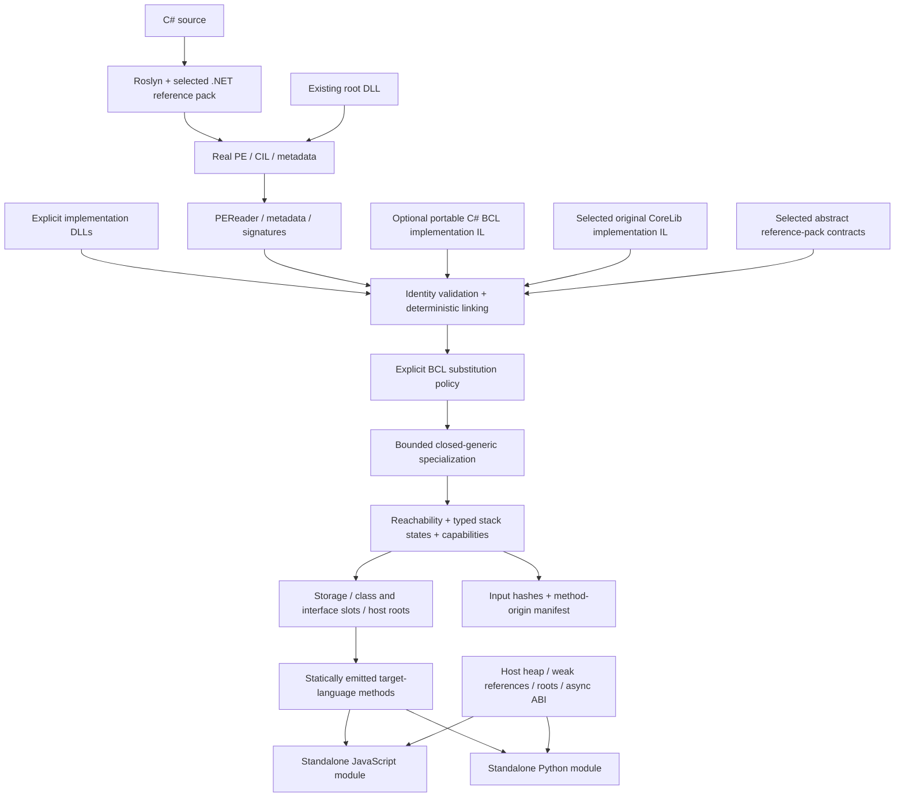

# Architecture — linked managed libraries and host runtime services

Updated 2026-09-16, second implementation batch. Source-artifact schema: 2; existing profile identifier: `portable-mvp`; optional library policy: `portable-bcl-v1`. These names describe the implemented subset, not universal CLI compatibility. The [initial architecture](history/0.1/architecture.md) is preserved as a historical snapshot. External evidence and design trade-offs are in [BCL/runtime research](research/bcl-runtime-2026-09-16.md).

## 1. Implemented pipeline

The library algorithms are compiled through the same CIL path as application methods. There is no hidden CoreCLR process, Python.NET import, dynamic IL decoder, or .NET download in a generated program. The conservative backend still uses source-level program-counter dispatch and explicit evaluation stacks; it does not yet implement SSA optimization or reconstruct idiomatic high-level source.

## 2. Physical modules

| Project | Responsibility |
|---|---|
| `Transpiler.Core` | PE/CIL import, scoped identities, deterministic linking, substitution policy, closed specialization, stack/capability analysis, runtime-contract declarations |
| `Transpiler.Frontend.Roslyn` | Source compilation, reference-pack discovery/hashes, `PortableCompilation.Link` orchestration |
| `Transpiler.Bcl` | Original portable C# collection, iterator, LINQ, task, awaiter and async-builder algorithms |
| `Transpiler.Backends` | Source emission, class/interface tables, value-copy semantics, target runtime helpers and host-service adapters |
| `Transpiler.Cli` | Commands, explicit dependency inputs, portable-library selection, provenance sidecars and atomic target-file replacement |

The BCL project does not reference compiler implementation types. It is compiled into an ordinary managed library; the compiler consumes its assembly. This prevents the library from depending on target source-printing internals and allows the same algorithms to be tested against standard .NET behavior.

## 3. Identity and reference boundaries

The source frontend uses `.NET 10` reference-pack assemblies rather than the compiler process's trusted platform assembly list. An explicit `--reference-pack` selects a directory; otherwise the resolver chooses an installed .NET 10 reference pack. A source manifest records its inputs. Reproduction still requires fixing SDK, pack, implementation assembly and compiler versions; automatic installed-pack discovery is not a lockfile-based MSBuild/NuGet resolver.

Application types are scoped as `[Assembly]Namespace.Type`. The linker validates supplied assembly name/version/culture/public-key-token identities and rejects mismatched or conflicting inputs. It permits one version per assembly simple name and remaps method tokens deterministically. Dependency order must not change output. Full type forwarding, arbitrary binding redirects, multiple load contexts and transitive package discovery are not implemented.

Reference assemblies are rejected as executable dependencies. The optional BCL loader has a narrow exception: selected abstract interfaces can contribute declaration metadata only. Their abstract declarations participate in interface dispatch; reference placeholder bodies are never used as algorithms.

## 4. Three implementation origins

**Original implementation IL:** the portable loader selects `System.Math.BigMul(Int32,Int32)` from the selected real `System.Private.CoreLib.dll`. The body passes through import, linking, analysis and emission. `--corelib` overrides the default host implementation path. Missing or unsupported bodies fail; there is no replacement with a same-named target helper. This is a small proof of original BCL adoption, not general CoreLib compatibility.

**Original portable managed code:** `Transpiler.Bcl` implements selected collection/LINQ/task contracts in C#. `LibrarySubstitution` maps explicit portable type identities to their public framework identities. Exact method resolution still applies after substitution, so an unsupported overload such as `List<T>.Sort()` remains an error.

**Target runtime services:** allocation representations, boxing, storage addresses, fundamental string/number operations, dispatch, weak references and host interoperability remain target-language helpers. These are not misidentified as translated BCL method bodies. The compilation manifest separates emitted bodies from external bindings.

Generated source containing framework implementation bodies includes the upstream .NET MIT notice. Compiler bundles preserve SDK notices. See [third-party provenance](../THIRD-PARTY-NOTICES.md).

## 5. Closed generic specialization and host reachability

`GenericSpecializer` retains constructed identities and instantiation-specific static storage. It substitutes generic type/method contexts and closes methods needed by internal calls, virtual/interface candidates and explicit MethodImpl maps. Expansion has limits: 16,384 methods, 4,096 types and 4,096 characters per constructed identity. Open dynamic instantiation and complete constraint verification are not implemented.

Some managed methods are invoked by host adapters rather than visible application call instructions. These must become explicit roots before ordinary reachability pruning. Two implemented examples are array-enumerator constructors and Task/GetAwaiter/GetResult/FIFO-pump operations used by the async host ABI. Without these roots, valid generated metadata can point to methods that were accidentally removed.

## 6. Values, addresses and dispatch

`CliValue` represents a struct value. Loads, stores, parameter passing, returns and boxing copy struct values; object references retain identity. `CliRef` represents a storage address. A reference into a struct field re-evaluates its parent storage on access, so assigning a new struct to that storage does not detach an existing field reference. The corpus tests nested storage, struct arrays, boxed values and generic collections of structs.

Class slots distinguish override from `newslot`. Interface tables consider implicit implementations, explicit MethodImpl maps and tested variance cases. Constrained calls preserve mutable value-type receivers and boxed dispatch. This remains a bounded compatibility implementation, not certification of every generic virtual/default-interface/variance combination.

Delegates carry target identity plus translated method identity and an immutable invocation sequence. The runtime supplies invocation and combination/removal/equality mechanics; captured closure bodies are ordinary translated methods. Low-level function pointers are supported here for delegate construction, not arbitrary unmanaged `calli` interop.

## 7. Collections, iterators and async are managed algorithms

The portable BCL supplies selected List, Queue, Stack and Enumerable methods. Enumerators implement the required generic/non-generic interfaces. Lazy LINQ uses actual Roslyn-generated iterator state machines, including early-disposal paths. Arrays and strings need a small host representation bridge, but enumeration algorithms use the managed `ArrayEnumerator<T>` implementation.

Tasks use a cooperative single-threaded FIFO scheduler implemented in C#. The builder starts the real Roslyn state machine. On suspension, a state-machine box owns the state and shares the completion Task. Release struct state machines and Debug class state machines are tested. Awaiters, completion sources, exception propagation and cancellation state are managed operations, not a rewrite of the async method into a host promise body.

JavaScript `invokeAsync` and Python `invoke_async` drive the translated scheduler and yield to their host event loop. They adapt return values and failures, with a step budget. This does not implement .NET thread-pool scheduling, synchronization/execution contexts, wall-clock timers or cancellation-token propagation. `Task.Run` and `Task.Delay` are rejected rather than silently emulated synchronously.

## 8. Heap and lifetime boundary

Ordinary managed objects remain JavaScript/Python objects. Host collectors trace their references, including closure storage, boxes, tasks and exception objects. There is no separate collector maintaining a shadow heap in this profile.

`HostedRuntime` adds generic weak references, identity hash codes, KeepAlive call boundaries and explicit root handles. JavaScript uses WeakRef/WeakMap; Python uses weakref/WeakKeyDictionary and weak-reference-enabled wrapper classes. The root map owns only objects explicitly retained by the host. It is not populated on every allocation. Releasing a handle removes that root; it does not force destruction or collection. Dereferencing a stale handle fails.

`runtimeInfo`/`runtime_info` exposes the actual service policy: host GC, weak-reference availability, current explicit-root count, no forced collection, no managed finalizers, no pinning, cooperative single-thread scheduling. A weak-reference test with a still-strongly-reachable object is evidence for target access and identity, not proof of precise reclamation timing.

## 9. Deliberately separate future architecture

The next compiler IR should make basic blocks, exception edges, storage locations and effects explicit before stack-to-SSA and source restructuring. Throwing, allocation, type initialization, mutation, callbacks and suspension must constrain transformations. The current source-dispatch backend remains a differential baseline.

A logical managed heap would require compiler-emitted roots and safepoints, not just a mark/sweep demonstration. A future C++ backend could adapt a native collector's execution-engine interface, including root scanning, type layout, barriers, handles and suspension. Those are distinct deployment profiles; no native GC, C++ emitter, arbitrary reflection engine or dynamic runtime is included here.

## 10. Validation and limits

The second-batch corpus has 64 harness cases, including 50 Release/Debug console configurations executed by both targets, deterministic re-emission, a three-assembly graph, provenance, async/root host ABI and rejection boundaries. [Testing](testing.md) explains the evidence and [compatibility](compatibility.md) distinguishes supported slices from remaining work. A public deployment still needs process isolation, resource quotas and a stronger metadata/type-safety verifier.
