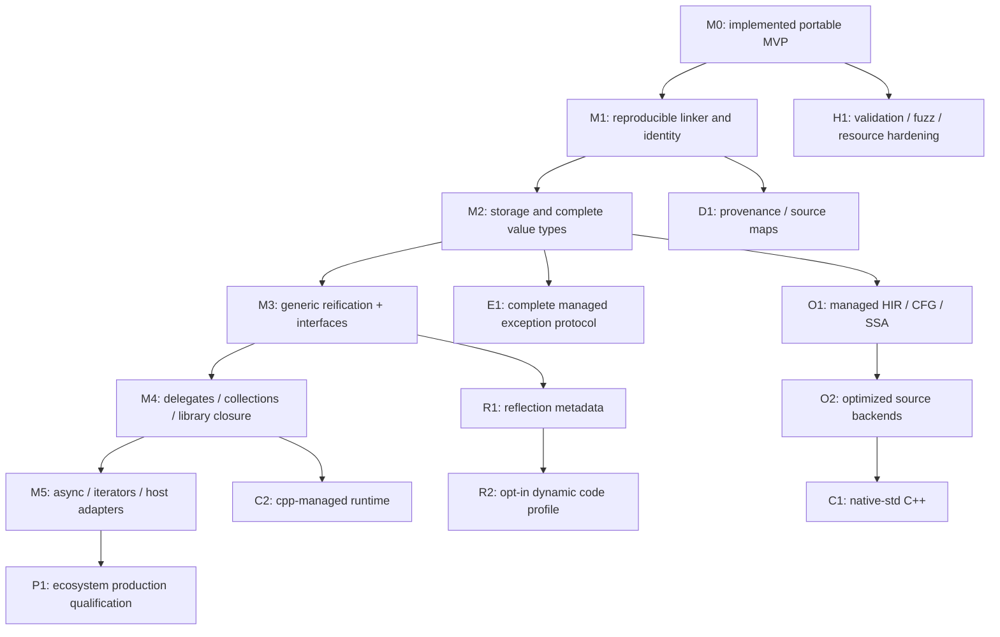

# Implementation plan: from portable MVP to broad CLI compilation

Date: 2026-09-16. This is a dependency-ordered engineering plan, not a promise of implementation dates. The only completed compiler profile is `portable-mvp`; JavaScript and Python are its implemented targets. C++, complete CLI compatibility, and complete .NET library compatibility are future work.

## 1. Delivery already present

The repository contains a Roslyn frontend, actual PE/CIL importer, immutable models, instruction decoder, normalized CIL, closed-world reachability, typed stack joins, exact intrinsic registry, source backends, semantic helpers, CLI, sample executable/library, differential tests, rejection tests, CI, and research/design documentation.

The first fully green baseline is commit `ae6d8511584ebabf09befdb838f1a1dc803c7494`, with 34 conformance cases passing in [Actions run 35086884135](https://github.com/wieslawsoltes/Transpiler/actions/runs/35086884135). It includes 22 Release/Debug program configurations executed in both target languages, 10 rejected source categories tested on both targets, library interop, and malformed PE handling. Subsequent commits add emission guards and additional rejection cases. Consult the latest CI artifact for current counts rather than treating this historical milestone as a permanent count.

The baseline is deliberately correctness-oriented: generated dispatchers and semantic helper calls come before aggressive source restructuring and optimization. Do not replace known-correct behavior merely to make emitted source look idiomatic.

## 2. Dependency graph

The branches are not independent promises. For example, interfaces need correct generic identity and value-type receiver behavior; async requires runtime/library support beyond recognizing a compiler-generated method name.

## 3. Milestones and acceptance gates

### M1 — Reproducible assembly graph and stable compiler API

Implement full assembly/type/member identity including scope, nesting, generic arity, calling convention, custom modifiers, and return type. Resolve type forwarding and framework facades. Add a reference-pack resolver and explicit project/assembly input graph with deterministic version policy. Reject ambiguous bindings instead of resolving by short name.

Introduce immutable `CompilationRequest`, `ReferenceResolver`, `CapabilityResolver`, diagnostic sink, cancellation, resource limits, pass registry, backend descriptor, and generated-artifact manifest. Separate backend packages without duplicating semantic analyses. Keep the current source emitter available as a baseline backend.

Acceptance: compile a three-assembly graph with overloads, nested types, cross-assembly inheritance, a diamond dependency, and conflicting version inputs; both targets match CoreCLR; bindings are inspectable and reproducible. No host TPA accident may change the selected reference contract. A clean machine can reproduce the build from the manifest.

Suggested commits: identity model; signature/metadata tests; resolver; graph reachability; cross-assembly linkage; public API/registry; reproducible manifest; migration of the CLI.

### M2 — Managed storage, value types, and remaining scalar semantics

Create explicit storage/value/address operations. Implement struct layout metadata, value copying, address-taken fields, nested structs, enums, nullable values, default/init operations, boxed copies, typed `ldobj`/`stobj`/`cpobj`, and constrained receiver behavior. Implement binary32 rounding at the correct boundaries, native integer profile widths, decimal, and explicit floating conversion policies.

Model field-RVA data and `RuntimeHelpers.InitializeArray` so ordinary constant array initializers become supported without assuming host memory layout. Add rectangular arrays, lower bounds, and recursively correct array covariance. Account for CLI boolean/raw storage corner cases independently of source-language canonical bool values.

Acceptance: mutation through an alias changes the original; loading/copying a struct does not alias it; boxing copies; nullable boxing agrees with CoreCLR; generic-ready storage operations carry sufficient type information; numerical edge/property tests cover every accepted conversion family. A `float` pipeline agrees at every rounded store boundary.

Suggested commits: storage IR; struct copy insertion; field/array addressing; box/unbox; constrained calls; numeric profiles; RVA data; arrays; conformance matrix update.

### M3 — Generics and interface dispatch

Represent generic definitions and constructed identities separately. Preserve constraints and generic contexts. Implement per-instantiation static storage and initialization, generic methods, dictionaries/type handles, reference-type code sharing, value-type specialization, recursive instantiation detection, generic virtual methods, variance, interface maps, MethodImpl maps, default interface methods, and covariant return adaptation.

Specialization must have a bounded policy. Unbounded expansion is a compiler failure mode, not a reason to silently erase types. A sharing fallback must retain constructed identity and required runtime dictionaries.

Acceptance: `Holder<int>` and `Holder<string>` have distinct statics; recursive generic calls terminate compilation under explicit budgets; value/reference instantiations preserve copying and boxing; interface calls through two different interfaces resolve correctly; explicit implementations and generic virtual calls match CoreCLR on both targets.

Suggested commits: generic identity/context import; substitution; specialization worklist; shared-code dictionaries; generic static storage; interface slots; MethodImpl; GVM; variance; negative budgets; full tests.

### M4 — Delegates and a useful portable library closure

Implement single/multicast delegates, invocation lists, equality, target identity, open/closed instance methods, `ldftn`/`ldvirtftn`, closures, event combination/removal, and callback ABI. Link or port a carefully selected core library closure: primitive helpers, String/StringBuilder, exceptions, collections, comparers/equality comparers, spans once lifetime rules exist, and common LINQ operators.

Keep exact API signature bindings and target implementation policy explicit. A substituted collection must preserve mutation-during-enumeration behavior, comparer semantics, exception order, and generic identity. Do not register a method simply because its name resembles a JavaScript/Python operation.

Acceptance: compile representative collection-heavy libraries, event/closure programs, and comparer-dependent algorithms with no custom application intrinsics. Each newly registered external signature has tests for ordinary values, null, error paths, mutation, and allocation/copy semantics. Unsupported calls remain diagnostics.

Suggested commits: delegate object model; function references; multicast semantics; host callbacks; base library contracts; collections; comparers; LINQ; library closure/trim report.

### M5 — Async, iterators, and explicit host integration

Implement the required state-machine interfaces, builder/awaiter contracts, Tasks, completion sources, cancellation, exception propagation, and iterator disposal. Initially execute the actual Roslyn-lowered state machines using the common IR. Add high-level lowering to promises or Python awaitables only after equivalence tests exist.

Define adapters for event loops, synchronization/execution context, scheduling, timers, clock, entropy, console, filesystem, networking, and browser/embedded hosts. Distinguish asynchronous completion from equivalent scheduling. Promise or asyncio integration is an ABI adapter, not proof that .NET task semantics are identical.

Acceptance: synchronous and asynchronous completion, nested awaits, cancellation races, finally during suspension, iterator early disposal, callback reentrancy, and exception timing match the selected scheduling profile. Browser, Node, and Python hosts declare different capabilities rather than accidentally exposing host-specific globals.

Suggested commits: state-machine library closure; task core; awaiters; iterator protocols; host loop adapters; cancellation; context policy; scheduling differential tests.

### E1 — Complete CLI exception protocol

Replace the limited per-frame protocol with explicit managed-frame state sufficient for two-pass exception search. Retain locals/evaluation state needed by filters, search outward without prematurely executing finally/fault blocks, evaluate filters with their specified exception behavior, select the handler, then unwind exactly the selected frames and handlers.

Implement fault clauses with hand-authored IL fixtures, cross-method filters, exception dispatch information, rethrow stack behavior, nested active-handler rules, and exception-region control-flow verification. Separate diagnostic stack formatting from exception identity and semantic control flow.

Acceptance: a caller's filter can observe callee state before the callee's finally; an exception thrown by a filter does not become the active propagated exception; finally replacement works across method boundaries; all handler-region combinations either verify correctly or fail before output. Test optimized and unoptimized backends identically.

### O1/O2 — Managed IR, SSA, and optimized source emission

Introduce explicit basic blocks and normal/exceptional edges. Convert evaluation-stack joins to SSA values, keep address-taken storage explicit, and model effects: throwing, allocation, storage, type initialization, callbacks, synchronization, and suspension. Implement dominators, liveness, escape analysis, stack promotion, copy propagation, constant propagation, and legal dead-code elimination.

Recover structured control flow where safe, retaining dispatch for irreducible regions. Coalesce instructions into blocks, remove redundant stack pushes, specialize integer helpers, use exact 32-bit fast paths such as `Math.imul` where justified, and devirtualize only under the closed-world/type-initialization contract. Add source maps and debug-preserving modes.

Acceptance: optimized output equals the baseline backend and CoreCLR on the full corpus and randomized tests. A transformation has explicit preconditions and negative tests showing why it cannot apply. Publish measured runtime, allocation, compilation-time, and output-size comparisons; do not combine performance with conformance percentages.

### R1/R2 — Reflection and dynamic execution profiles

Implement metadata-only reflection first: types, members, generic construction, attributes, assignability, method/constructor invocation, and explicit trimming roots. Retain only required metadata where the selected contract permits it. Add an opt-in dynamic profile later for loading new assemblies, expression compilation, and Reflection.Emit-like facilities.

Dynamic support may use an in-process compiler or a managed-IR interpreter implemented in the target. Such a component is a separately declared profile, not an invisible fallback in standalone source mode. Browser CSP, code loading, resource budgets, and trust boundaries must be part of the profile.

Acceptance: reflection-visible identity agrees with statically compiled identity; trimming reports explain missing metadata; dynamic compilation is explicitly enabled and cannot bypass host capability limits.

### C1/C2 — C++ source targets

Implement `native-std` first for the explicitly accepted ownership/storage subset. Emit standard C++ with correct fixed-width arithmetic, copies, exception behavior, ABI, and deterministic lifetime rules. Reuse managed HIR rather than adding a new source-language rewrite path. An optional MLIR/EmitC route can serve code generation, not replace managed semantics.

For `cpp-managed`, implement or integrate the explicitly selected object/heap/runtime services. Resolve cycles, interior references, type identity, weak references, finalization policy, generic sharing, and interop. Standard-library-only dependencies and absence of runtime services are different claims.

Acceptance: all accepted profile programs compile with at least two conforming C++ compilers, match the baseline semantics, and pass sanitizer runs. Programs requiring undeclared managed services are rejected. Generated/runtime source and required dependencies are included in the artifact manifest.

### H1/P1 — Hardening and production qualification

Add a strict verifier, hostile metadata/CIL fuzzing, bounded decode/metadata recursion, graph/instantiation limits, compile cancellation, process isolation, runtime quotas, stack-overflow policy, and malformed-input regression fixtures. Audit emitted identifiers, JS prototype-sensitive keys, source quoting, PDB paths, and output containment. Add framework/host ABI versioning and migration tests.

Expand CI across Windows/Linux/macOS and x64/ARM64, supported Node/Python versions, browsers, and selected .NET oracle versions. Address culture/formatting, isolated-surrogate I/O, exact default exception messages where required, deep recursion, memory pressure, weak references, and thread/volatile/atomic behavior through explicit profiles.

Acceptance: documented support is backed by a reproducible environment matrix; no known silent fallback exists; inputs have resource limits; version changes cannot silently change the ABI; releases include provenance, license notices, source, test reports, and capability manifests.

## 4. Feature-completion checklist

A feature is not complete merely when its opcode appears in a switch. Every feature needs all applicable layers:

1. Specification and modern-.NET-augment references, supported profile, and explicit exclusions.
2. Metadata/import representation and typed verification rules.
3. Reachability/linkage effects and lowering into target-neutral semantics.
4. Implementations for every claimed target, including exception/copy/identity behavior.
5. Exact BCL/host contract where required, plus source/host ABI behavior.
6. Positive, negative, boundary, Release/Debug, and differential tests; capability ledger and diagnostics updated.

When implementing JavaScript first, keep Python compile-time rejection until Python support is actually present. Do not let backend maturity become an undocumented difference.

## 5. Priority for the next implementation cycle

The highest-value order is: **hermetic multi-assembly linking → value-type storage/copying → generic identities and interface dispatch → delegates/core collections → async and host adapters**. In parallel, add stronger verification, an explicit CFG, and provenance. These unlock useful .NET library ports much faster than adding many superficial target-language printers.

The first optimization should be measured block coalescing/stack elimination, not a wholesale rewrite. The first C++ target should be a documented native subset, not a claim that a few generated classes implement the entire CLR.
